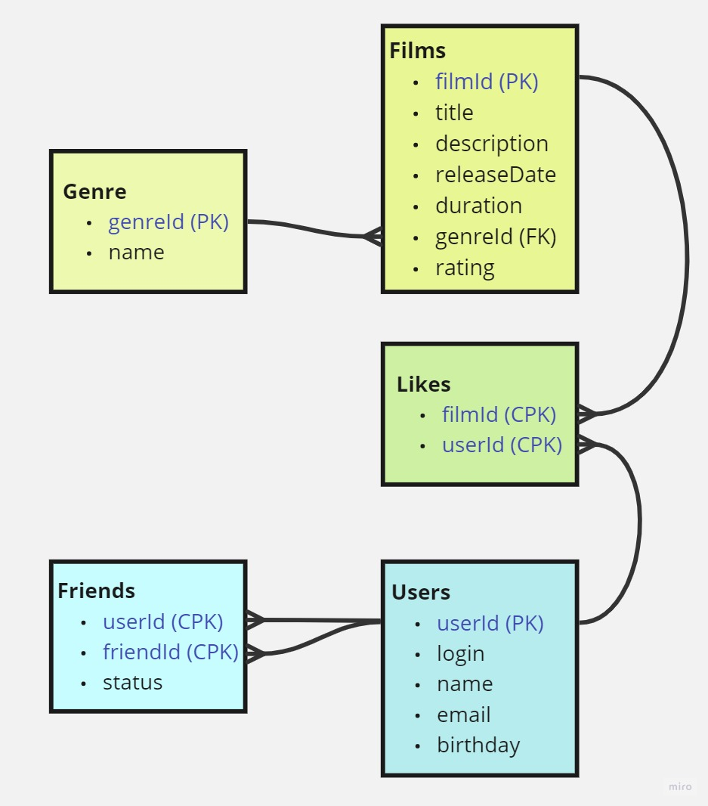

# java-filmorate



## Примеры запросов для получения данных

### Получение всех фильмов
```
SELECT *
FROM films;
```

### Получение фильма с id=1
```
SELECT *
FROM films
WHERE filmId = 1;
```

### Получение 10 самых популярных фильмов
```
SELECT *
FROM films AS f
WHERE f.filmId IN (SELECT l.filmId
                   FROM likes AS l
                   GROUP BY l.filmId
                   ORDER BY count(l.userId) DESC
                   LIMIT 10);
```

### Получение всех пользователей
```
SELECT *
FROM users;
```

### Получение пользователя с id=1
```
SELECT *
FROM users
WHERE userId = 1;
```

### Получение друзей пользователя с id=1
```
SELECT *
FROM users AS u
WHERE u.userId IN (SELECT f.friendId
                   FROM friends AS f
                   WHERE f.userId = 1);
```

### Получение общих друзей для пользователей с id=1 и пользователя с id=2
```
SELECT *
FROM users AS u
WHERE u.userId IN (SELECT friendid
                   FROM (SELECT f.friendId
                         FROM friends AS f
                         WHERE f.userId = 1) AS x
                   WHERE userid = 2);
```